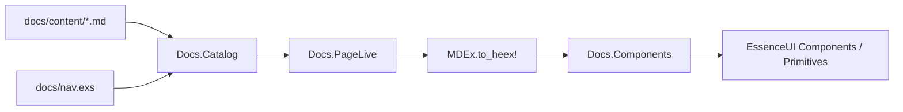

# Essence UI Docs Engine

Custom documentation site (Radix-inspired) that replaces Phoenix Storybook for developer docs.

## Decisions

| Choice | Value |
|--------|--------|
| Authoring | Markdown + embedded HEEx (`MDEx` phoenix_heex) |
| Scope | Unified Themes + Primitives in one site |
| Hosting | Phoenix LiveView at `/docs` |
| Migration | Parallel with Storybook, then cut over |

## Goals

- Write long-form guides as Markdown
- Show live components with HEEx and optional CSS source
- Auto props tables from `attr` metadata
- Anatomy / composition sections for compound components
- Radix-like IA: Overview, Theme, Typography, Layout, Components, Utilities, Primitives, Examples

## Architecture

```
docs/
  ENGINE.md                 # this file
  nav.exs                   # sidebar IA
  content/**/*.md           # pages (frontmatter + Markdown/HEEx)

lib/essence_ui_web/docs/
  catalog.ex                # compile-time page index + nav
  components.ex             # <.demo>, <.props_table>, <.anatomy>, <.code_block>
  page_live.ex              # single LiveView for all docs routes
```



### Page format

```markdown
---
title: Button
description: Triggers an action or event.
---

Buttons allow users to take actions.

<.demo heex={~s[<.button>Button</.button>]}>
  <.button>Button</.button>
</.demo>

## API Reference

<.props_table module={EssenceUI.Components.Button} function={:button} />
```

Frontmatter is simple `key: value` lines (no nested YAML). Body is Markdown with Phoenix function components via MDEx HEEx.

### Engine primitives

| Component | Role |
|-----------|------|
| `<.demo>` | Live preview + HEEx/CSS code tabs |
| `<.props_table>` | Reflects `module.__components__()[fun].attrs` |
| `<.anatomy>` | Named parts list for compound APIs |
| `<.code_block>` | Standalone highlighted snippet |

### Routing

| URL | Behavior |
|-----|----------|
| `/` | Themes marketing home |
| `/themes/docs/*path` | Themes docs pages |
| `/primitives` · `/primitives/docs/*` | Primitives marketing + docs |
| `/colors` · `/colors/docs/*` | Colors explorer + docs |
| `/themes/playground` | ThemePanel playground |
| `/storybook` | Storybook (internal until catalog parity) |
| `/crm` | Recruiting CRM example |

Content lives under `docs/content/{themes,primitives,colors}/` with nav in `docs/nav/*.exs`.

## Migration plan

### Phase 0 — Engine (this PR)

- Catalog + PageLive + docs chrome
- Sample pages: Getting started, Button (themes), Dialog (primitives)
- Storybook remains at `/`

### Phase 1 — Overview & Theme guides

Migrate Getting Started fully; add Styling, Layout, Theme overview (Radix Themes docs IA).

### Phase 2 — Themes catalog

For each `storybook/themes/**/*.story.exs` → `docs/content/{section}/{name}.md` with demos + props tables. Port Variation/VariationGroup examples as `<.demo>` blocks.

### Phase 3 — Primitives catalog

Same for `storybook/primitives/*.story.exs`, using `variant="primitive"` demos (`.radix-demo` canvas).

### Phase 4 — Examples

Port `storybook/examples/*` and decide CRM: keep `/crm` LiveView, link from Examples; drop duplicate story if redundant.

### Phase 5 — Cutover

1. Move Storybook to `/storybook` (or remove)
2. Point `/` → `/docs`
3. Retarget Playwright helpers (`gotoPrimitive` → `/docs/primitives/...`)
4. Remove `phoenix_storybook` dep + `storybook/` tree when parity is done

## Dogfooding

The docs site is built with Essence UI components (`Flex`, `Box`, `Text`, `Heading`,
`Badge`, `Card`, `Tabs`, `Table`, `DataList`, `Code`, `ScrollArea`, `Separator`,
`es_link`). Custom CSS is limited to layout/prose glue.

Pitfalls found and fixed while building the chrome:

| Issue | Fix |
|-------|-----|
| `es_link` had no LiveView `navigate`/`patch` | Delegate to `Phoenix.Component.link/1` |
| `Box`/`Flex` `as` only allowed `div`/`span` | Allow semantic tags (`aside`, `main`, `nav`, …) |
| `ExtractProps` dropped list `class` values | Normalize class lists |
| `Text` has no margin props | Prefer `Flex`/`Box` spacing (or inline style) |
| `~S"""` inside HEEx attrs in Markdown | MDEx swallows the rest of the page — use `~S\|...\|` / `~s[...]` |
| Desktop-first stacked sidebar on mobile | Mobile-first topbar + drawer; sidebar from `min-width: 901px` |
| `Box` required `inner_block` | Slot optional (empty backdrop/spacer boxes) |
| Multiline HEEx attrs / raw HTML in string attrs | Prefer Markdown fences; keep HEEx attrs single-line; use slots for anatomy |

### Authoring gotcha

MDEx `phoenix_heex` can swallow the rest of a page when:

- HEEx attributes span multiple lines with complex values (`parts={[...]}`)
- Attribute strings contain raw HTML tags (`<main>`, `<div>`) across lines
- Elixir `"""` heredocs appear inside attributes

Prefer Markdown fenced code for static snippets, single-line `heex={~s[...]}` for demo source, and slots for structured data.

## Authoring rules

1. One job per page; lead with a short description, then demos, then API
2. Prefer `<.demo heex={...}>` so source and preview stay in sync visually (small duplication is OK)
3. Put CSS in `css={...}` only when teaching styles (primitives demos, overrides)
4. Import nothing in Markdown — `PageLive` imports docs helpers + `EssenceUI.Components` + primitives aliases
5. Keep nav in `docs/nav.exs` in sync when adding pages
6. Avoid `"""` sigils in Markdown HEEx attributes (use `~S|...|`)

## Success criteria

- [x] `/docs` renders Markdown with live Essence UI components
- [x] Demo shows HEEx (and optional CSS) beside preview
- [x] Props table generated from `attr`
- [x] Mobile-first layout (topbar + drawer; desktop sidebar)
- [ ] All Storybook stories have docs equivalents
- [ ] Storybook removed; E2E green against `/docs`
