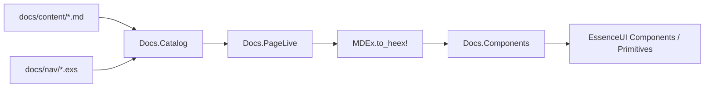

# Essence UI Docs Engine

Custom documentation site (Radix-inspired) hosted as Phoenix LiveView + MDEx.

## Decisions

| Choice | Value |
|--------|--------|
| Authoring | Markdown + embedded HEEx (`MDEx` phoenix_heex) |
| Scope | Unified Themes + Primitives in one site |
| Hosting | Phoenix LiveView at `/themes/docs`, `/primitives/docs`, `/colors/docs` |

## Goals

- Write long-form guides as Markdown
- Show live components with HEEx and optional CSS source
- Auto props tables from `attr` metadata
- Anatomy / composition sections for compound components
- Radix-like IA: Overview, Theme, Typography, Layout, Components, Utilities, Primitives, Examples

## Architecture

```
docs/
  ENGINE.md                 # this file
  nav/*.exs                 # sidebar IA per section
  content/**/*.md           # pages (frontmatter + Markdown/HEEx)

lib/essence_ui_web/docs/
  catalog.ex                # compile-time page index + nav
  components.ex             # <.demo>, <.props_table>, <.anatomy>, <.code_block>
  page_live.ex              # single LiveView for all docs routes
```



### Page format

```markdown
---
title: Button
description: Triggers an action or event.
---

Buttons allow users to take actions.

<.demo>
  <:heex code={~S|<.button>Button</.button>|}>
    <.button>Button</.button>
  </:heex>
</.demo>

## API Reference

<.props_table module={EssenceUI.Components.Button} function={:button} />
```

Frontmatter is simple `key: value` lines (no nested YAML). Body is Markdown with Phoenix function components via MDEx HEEx.

### Engine primitives

| Component | Role |
|-----------|------|
| `<.demo>` | Live preview + HEEx/CSS code tabs via `<:heex>` slot and `css={…}` attr |
| `primitive_css/1` | Helper for Markdown: load primitives demo CSS for `css={primitive_css("dialog")}` |
| `<.props_table>` | Reflects `module.__components__()[fun].attrs` |
| `<.anatomy>` | Named parts list for compound APIs |
| `<.highlights>` | Feature bullet list (Radix Highlights) |
| `<.data_attributes_table>` | `data-*` attribute reference |
| `<.keyboard_table>` | Accessibility keyboard interactions |
| `<.code_block>` | Standalone highlighted snippet |

Primitives demos set `theme="light"` (docs CSS has no dark theme), `variant="primitive"`, `component="…"`, and `css={primitive_css("…")}`. The CSS tab shows the component stylesheet only (no demo canvas). The preview injects canvas + component CSS via `<style>` tags; `Demo*` class names keep demo styles from clashing. Pass `code` on `<:heex>` for the HEEx tab source.

### Routing

| URL | Behavior |
|-----|----------|
| `/` | Themes marketing home |
| `/themes/docs/*path` | Themes docs pages |
| `/primitives` · `/primitives/docs/*` | Primitives marketing + docs |
| `/colors` · `/colors/docs/*` | Colors explorer + docs |
| `/themes/playground` | ThemePanel playground |
| `/crm` | Recruiting CRM example |

Content lives under `docs/content/{themes,primitives,colors}/` with nav in `docs/nav/*.exs`.

## Dogfooding

The docs site is built with Essence UI components (`Flex`, `Box`, `Text`, `Heading`,
`Badge`, `Card`, `Tabs`, `Table`, `DataList`, `Code`, `ScrollArea`, `Separator`,
`es_link`). Custom CSS is limited to layout/prose glue.

Pitfalls found and fixed while building the chrome:

| Issue | Fix |
|-------|-----|
| `es_link` had no LiveView `navigate`/`patch` | Delegate to `Phoenix.Component.link/1` |
| `Box`/`Flex` `as` only allowed `div`/`span` | Allow semantic tags (`aside`, `main`, `nav`, …) |
| `ExtractProps` dropped list `class` values | Normalize class lists |
| `Text` has no margin props | Prefer `Flex`/`Box` spacing (or inline style) |
| `~S"""` inside HEEx attrs in Markdown | MDEx swallows the rest of the page — use `~S\|...\|` / `~s[...]` |
| Desktop-first stacked sidebar on mobile | Mobile-first topbar + drawer; sidebar from `min-width: 901px` |
| `Box` required `inner_block` | Slot optional (empty backdrop/spacer boxes) |
| Multiline HEEx attrs / raw HTML in string attrs | Prefer Markdown fences; keep HEEx attrs single-line; use slots for anatomy |

### Authoring gotcha

MDEx `phoenix_heex` can swallow the rest of a page when:

- HEEx attributes span multiple lines with complex values (`parts={[...]}`)
- Attribute strings contain raw HTML tags (`<main>`, `<div>`) across lines
- Elixir `"""` heredocs appear inside attributes

Prefer Markdown fenced code for static snippets, single-line `heex={~s[...]}` for demo source, and slots for structured data.

## Primitives internals

`EssenceUI.Primitives.Menu` is internal (like Radix `@radix-ui/react-menu`). DropdownMenu,
ContextMenu, and Menubar thin-wrap it for shared item/submenu markup and JS behavior.
Do not add a Menu docs page or nav entry.

## Authoring rules

1. One job per page; lead with a short description, then demos, then API
2. Use `<.demo>` with `<:heex>` (live markup); pass `code` on the slot for the HEEx tab
3. Primitives: `theme="light" variant="primitive" component="…" css={primitive_css("…")}` — lock light theme (docs CSS has no dark); CSS is an argument (not a slot); component CSS only in the CSS tab; preview uses `Demo*` classes + injected `<style>`
4. Import nothing in Markdown — `PageLive` imports docs helpers + `EssenceUI.Components` + **all** `EssenceUI.Primitives.*` aliases
5. Keep nav in `docs/nav/primitives.exs` (and siblings) in sync when adding pages
6. Avoid `"""` sigils in Markdown HEEx attributes (use `~s[...]` / `~S|...|`)
7. Primitives pages: include highlights, anatomy, props for every public part, keyboard when relevant
8. Document Essence attrs honestly (LiveView event names, not React callbacks); add `doc:` on `attr` when filling API tables

## Success criteria

- [x] Docs render Markdown with live Essence UI components
- [x] Demo shows HEEx (and optional CSS) beside preview when `code=` / `css=` provided
- [x] Props table generated from `attr`
- [x] Mobile-first layout (topbar + drawer; desktop sidebar)
- [x] Themes + Primitives catalogs hosted on MDEx/LiveView docs
- [x] Playwright e2e targets `/primitives/docs` and `/themes/docs`
